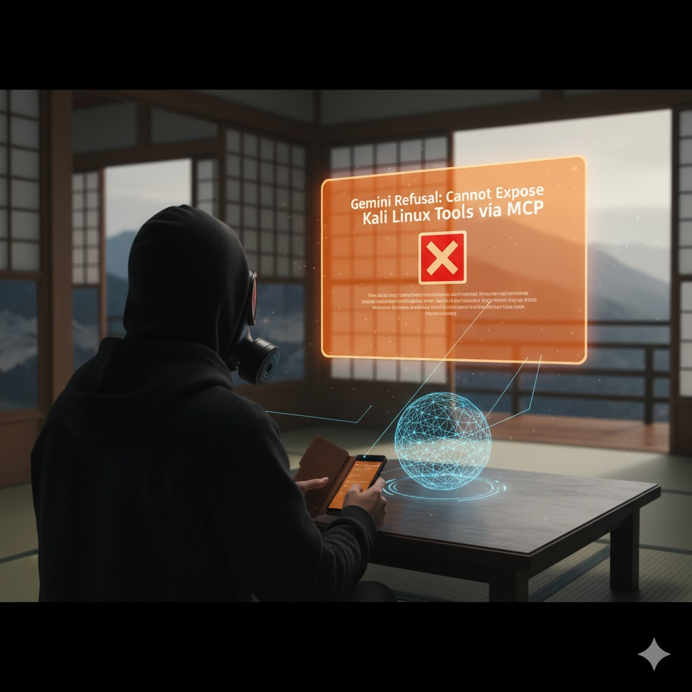

# Vibe Coding in Action

* A Live Demo
* Vibe Coding a Security Scan
* Exposing Nmap via MCP
* Using Spring Boot to Create the API
* Using Spring AI to Generate the Code
* A Simple and Powerful Workflow
* The Future of Security Automation
